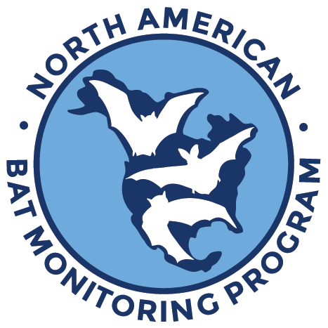

# North American Bat Monitoring Program: NABat Acoustic ML 

## Authors
Benjamin Gotthold, Ali Khalighifar, Bethany R. Straw, Brian E. Reichert

## Abstract

Bats play crucial ecological roles, and provide valuable ecosystem services, yet many populations face serious threats from various ecological disturbances. The North American Bat Monitoring Program (NABat) aims to assess status and trends of bat populations, while developing innovative and community-driven conservation solutions using its unique data and technology infrastructure. To support scalability and transparency in the NABat acoustic data pipeline, we developed a fully-automated, machine-learning algorithm. This codebase was used to develop V1.0 of our automated machine-learning system for detecting and classifying bat calls in ultrasonic recordings.  This system performs three major functions:

1) Processing raw audio recording files, extracting bat pulses, and creating spectrogram images of detected pulses.
2) Iteratively training a deep-learning artificial network to create an algorithm that classifies bat pulses to species.
3) Validating and evaluating the classification algorithm's classification performance on holdback data.

## Requirements

The code in this repository was written to run in the cloud on Amazon Sagemaker. Unless otherwise noted within the code, all required libraries are provided by default with instantiations of the Amazon Sagemaker conda_python3 and conda_tensorflow_p36 execution environments. For convenience, a requirements.txt configuration file is included in the repository, but has not been build-tested outside of Amazon Sagemaker environments.

## ORCIDs and Contact Information

Benjamin Gotthold (https://orcid.org/0000-0003-4234-5042)

Ali Khalighifar (https://orcid.org/0000-0002-2949-8143)

Bethany R. Straw (https://orcid.org/0000-0001-9086-4600)

Brian E. Reichert (https://orcid.org/0000-0002-9640-0695)

If you have questions about the software, please contact Brian Reichert (breichert@usgs.gov).

## License

This project is licensed under the Creative Commons Attribution 4.0 International Public License.

## Suggested Citation for Software

Gotthold, B.S., Khalighifar, A., Straw, B.R., Reichert, B.E., 2022, North American Bat Monitoring Program: NABat Acoustic ML, Version 1.0.1: U.S. Geological Survey software release, https://doi.org/10.5066/P9XJRJZX.

## Larger Citation

Gotthold, B., Khalighifar, A., Straw, B.R., and Reichert, B.E., 2022, Training dataset for NABat Machine Learning V1.0: U.S. Geological Survey data release, https://doi.org/10.5066/P969TX8F.

## IPDS

IP-137366, IP-136565
